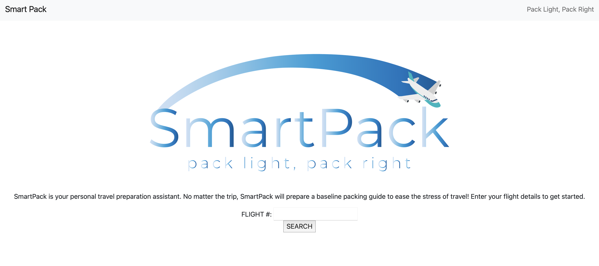

# SmartPack

## Description
Smart Pack is a web application that allows users to input their flight number to recieve a packing list based on weather for their destination. The app also takes user input to create preferences to guide the creation of the packing list. The packing list is then saved to local storage and displayed for the user to reference. 

## Screenshot

## Links
- Github Repo: https://github.com/mayalorimer/SmartPack 
- Github Pages: https://mayalorimer.github.io/SmartPack/